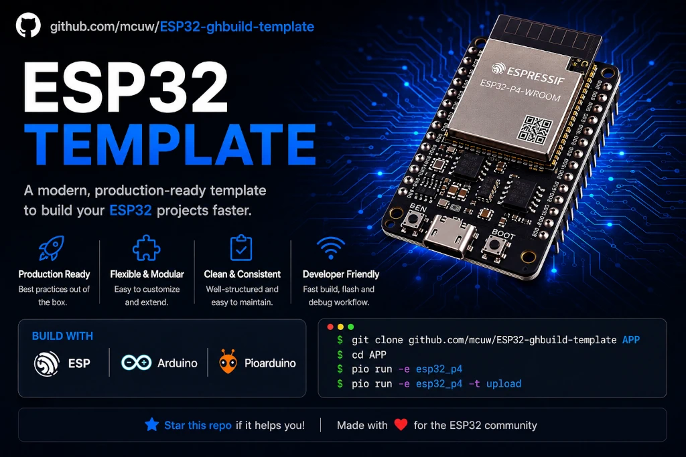

# ESP32 project template



## Description

This is a project template to create microcontroller apps with automated firmware builds for [ESP32](https://www.espressif.com/en/products/socs/esp32), [ESP32-S2](https://www.espressif.com/en/products/socs/esp32-s2), [ESP32-S3](https://www.espressif.com/en/products/socs/esp32-s3), [ESP32-C6](https://www.espressif.com/en/products/socs/esp32-c6), [ESP32-H2](https://www.espressif.com/en/products/socs/esp32-h2) and [ESP32-P4](https://www.espressif.com/en/products/socs/esp32-p4) microcontroller boards. It uses [GitHub Actions](https://github.com/features/actions) and [pioarduino](#pioarduino) (for old boards [platformIO](#platformio)). Use this repository as a template for your own ESP32 projects. If you like this template then please support by giving a star to this repository.

## Features

- Uses Platformio
- Supports multiple firmwares builds with github actions
- Example code

## ⭐ Stargazers

<div align="center">

[](https://star-history.com/#mcuw/ESP32-ghbuild-template&Date)

</div>

## Prerequisites

- [VSCode](https://code.visualstudio.com/) IDE

- [pioarduino IDE](#Pioarduino) for [VSCode](https://code.visualstudio.com/) IDE

## Supported boards

You can use these links to buy a developer board. If you want to support this project then use the affiliate links marked with a *. For you it does not cost more.


- ESP32
  - [LilyGo](https://lilygo.cc/) [T-Beam v0.7/ v1.1](https://s.click.aliexpress.com/e/_DBzslDV)* GPS
  - [LilyGo](https://lilygo.cc/) [TTGO LORA32 v1.6.1](https://s.click.aliexpress.com/e/_c3WEJk85)* LoRA
  - [lolin32](https://www.wemos.cc/en/latest/d32/d32.html)
  - [lolin D32 pro](https://www.wemos.cc/en/latest/d32/d32_pro.html)
- ESP32 S2
- ESP32 S3 with dual-core processor
  - [LilyGo](https://lilygo.cc/) [T-Display S3](https://s.click.aliexpress.com/e/_DBmOMkn)*
  - [LilyGo](https://lilygo.cc/) [T-Display-S3 AMOLED](https://s.click.aliexpress.com/e/_DmboYpZ)*
  - [LilyGo](https://lilygo.cc/) [T-Display-S3 Touch](https://s.click.aliexpress.com/e/_DCBgPlV)*
  - [LilyGo](https://lilygo.cc/) [T-Display S3 Long](https://s.click.aliexpress.com/e/_Dl6UVMx)*
  - [LilyGo](https://lilygo.cc/) [T-Watch S3](https://s.click.aliexpress.com/e/_DEZVvH1)*
  - [LilyGo](https://lilygo.cc/) [T-CameraPlus ESP32-S3](https://s.click.aliexpress.com/e/_DkytBeT)*
  - [LilyGo](https://lilygo.cc/) [T-RGB](https://s.click.aliexpress.com/e/_Dem6i0b)*
  - [LilyGo](https://lilygo.cc/) [T-Deck](https://s.click.aliexpress.com/e/_DBPnZmL)*
  - [LilyGo](https://lilygo.cc/) [T-Deck Plus](https://s.click.aliexpress.com/e/_DDeskaP)*
  - [LilyGo](https://lilygo.cc/) [T3-S3](https://s.click.aliexpress.com/e/_c3o28ou9)* LoRa 2.4 GHz
  - [Waveshare](https://www.waveshare.com/) [ESP32-S3 GEEK](https://s.click.aliexpress.com/e/_c35mBhkF)*
  - [Waveshare](https://www.waveshare.com/) [ESP32-S3 AMOLED 2.06](https://s.click.aliexpress.com/e/_c34ka7n1)* Watch with 16 MB flash, AMOLED touch display, Wi-Fi 5, BT 5 LE, accelerometer, gyroscope

- ESP32 C6 with WiFi 6 and BT-5 LE
  - [NanoESP32-C6](https://s.click.aliexpress.com/e/_ooBtUih)* with 16MB flash
  - [UICPAL ESP32-C6](https://s.click.aliexpress.com/e/_DeLjVMb)* with 4MB flash and W2812 RGB LED
  - [LilyGo](https://lilygo.cc/) [T-QT C6](https://lilygo.cc/products/t-qt-c6) Ring [SDK](https://github.com/mcuw/esp32-t-qt-c6-sdk) with 4 MB flash, touch display, 6-Axis Sensor
  - [Waveshare](https://www.waveshare.com/) [ESP32-C6 AMOLED 2.06](https://s.click.aliexpress.com/e/_c34ka7n1)* Watch with 16 MB flash, AMOLED touch display, Wi-Fi 6, BT 5 LE, accelerometer, gyroscope

- ESP32 P4 with dual-core processor up to 400 MHz
  - [GUITION](https://www.guition.com/) [10.1" ESP32-P4 LCD Display Development Board](https://s.click.aliexpress.com/e/_c2vAKbXD)* with 1280x800 Capacitive Touch Screen, Wi-Fi 6, battery and speaker
  - [GUITION](https://www.guition.com/) [JC-ESP32P4-M3-DEV](https://s.click.aliexpress.com/e/_c39YU9i9)* ESP32-P4 with ESP32-C6 Mini, Wi-Fi 6, Ethernet, TF card slot, Speaker header, Li-Ion Battery connector, microphone
  - [GUITION](https://www.guition.com/) [C4880P443C-I-W-Y](https://s.click.aliexpress.com/e/_c4TfKXmd)* ESP32-P4 with ESP32-C6, 4.3 inch 480 * 800 IPS capacitive touch, 2MP camera module, Wi-Fi 6, Ethernet, TF card slot, Speaker header, Li-Ion Battery connector, BT 5

## Protoyping

If you are new to the Arduino world then play around with free online simulators before you create a new repository or soldering. After that deep dive by using this template for your professioal arduino projects.

- [Wokwi](https://wokwi.com/esp32)
- [Cirkit designer](https://app.cirkitdesigner.com/)

## Get Started


1. Login to github

2. Click on `Use this template` to create a new git repository
3. Replace the whole content of this [README.md](README.md) file
4. Implement your application in the [src/main.cpp](src/main.cpp)
5. Comment your new change in the [CHANGELOG.md](CHANGELOG.md) file
6. Push your changes

```sh
git add .
```

```sh
git commit -am "my app"
```

```sh
git push -u origin main
```

5. Use "create release" option on github to trigger a firmware build (input a new tag version, e.g. v1.0.0)

6. After the CI build, you can find your firmware files under “Releases”. Files with `.factory.` in the name are meant for the initial flashing via cable. The others are for updates (e.g. OTA) when a factory version is already on the device. The `.factory.` files also include a pre-installed file system, bootloader, partition scheme, and safeboot partition.

## How to flash your microcontroller

Variant A - Online and no need to install an app
- download a `.factory.bin` or `.bin` firmware file from releases then flash with:
https://mcuw.github.io/ESPConnect/

Variant B - Visual Studio Code
1. Select a board in Visual Studio Code. `Default` env builds all boards.


2. Flash your board


## Customize your project with [platformio.ini](platformio.ini)

You can reduce the firmware build to your dev board with the "default_envs=" configuration.

Or override the boards configs with a new `.ini` file under [extra_configs](extra_configs/) and import it in the [platformio.ini](platformio.ini).

## CHANGELOG

You can write your changes in the [CHANGELOG.md](CHANGELOG.md) before you create a release. It will be shown under the release page.

## Contribution

Please see [CONTRIBUTING.md](CONTRIBUTING.md) for details on how to contribute issues, fixes, and patches to this project.

## Technical informations

<details>
 <summary><h3>GitHub Actions - Workflow</h3></summary>

The release build happens in the `build & release` workflow: [build_release.yml](.github/workflows/build_release.yml).
It creates a release, after creation of a new git tag (named it like `v1.0.0`).

If you want to test the build on all merge w/o creating a tag then the `build` workflow is what you looking for: [build.yml](.github/workflows/build.yml)
</details>

<details>
<summary><h3>Platformio</h3></summary>

[PlatformIO](https://platformio.org/) is a tool to create microcontroller apps for arduino platforms and compatibles (esp32). You can install the [Visual Studio Code extension](https://platformio.org/install/ide?install=vscode) in the [Visual Studio Code](https://code.visualstudio.com/) IDE.
</details>

<details>
<summary><h3>Pioarduino</h3></summary>

The pioarduino platform is platformio compatible and supports latest boards like [ESP32-C6](https://www.espressif.com/en/products/socs/esp32-c6), [ESP32-H2](https://www.espressif.com/en/products/socs/esp32-h2) and [ESP32-P4](https://www.espressif.com/en/products/socs/esp32-p4) and others. There is a [pioarduino IDE](https://marketplace.visualstudio.com/items?itemName=pioarduino.pioarduino-ide) extension which replaces the [PlatformIO IDE](https://marketplace.visualstudio.com/items?itemName=platformio.platformio-ide) extension for VSCode.
</details>

<details>
<summary><h3>Python extra_script.py</h3></summary>

There is a tiny python script needed to customize the firmware filenames within platformio, see documentation: https://docs.platformio.org/en/stable/scripting/examples/custom_program_name.html

The [extra_script.py](extra_script.py) script gets the platformio env (e.g. lolin32) and the git-tag for the firmware filename.
This is required to publish several firmware names in the github artifacts of a release.
</details>

<details>
<summary><h3>Example Release</h3></summary>

see [Releases](https://github.com/mcuw/esp-ghbuild-template/releases) on the right sidemenu.
</details>


## Disclaimer

Please support by donation a coffee: [buymeacoffee](https://buymeacoffee.com/vuongngo)

Contribution and help - if you find an issue or wants to contribute then please do not hesitate to create a pull request or an issue.

We provide our build template as is, and we make no promises or guarantees about this code.


